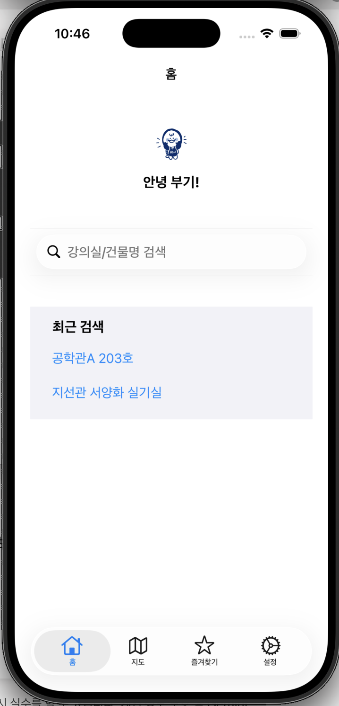
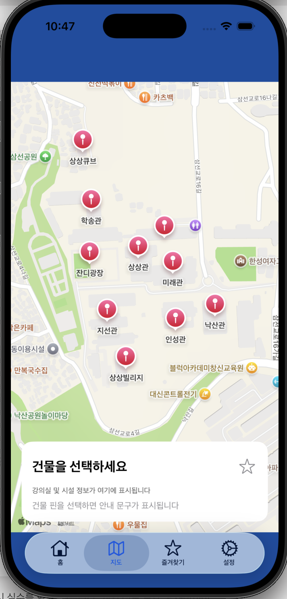
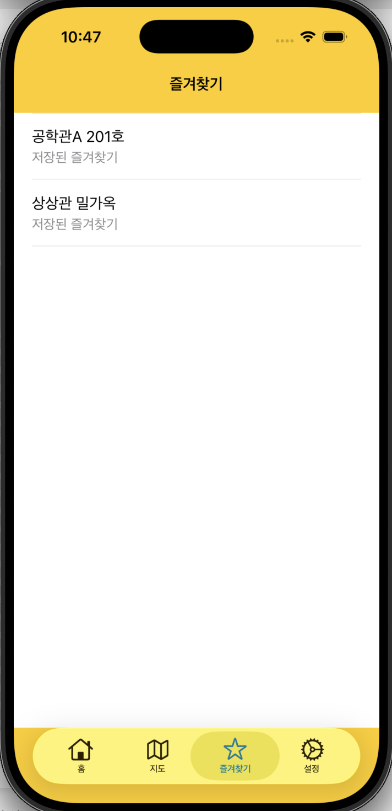

# 🗺️ HansungBoogi (한성부기)

<div align="center">
  
</div>

> **"지도는 복잡하게, 길찾기는 단순하게!"** > 한성대학교 학생들이 건물과 강의실 위치를 쉽고 빠르게 찾을 수 있도록 돕는 UIKit 기반의 iOS 캠퍼스 내비게이션 앱입니다.

<br>

## 📌 목차
1. [프로젝트 소개 및 목적](#-프로젝트-소개-및-목적)
2. [앱 화면 구성 (미리보기)](#-앱-화면-구성-미리보기)
3. [주요 기능 및 체크리스트](#-주요-기능-및-체크리스트)
4. [기술 스택 및 아키텍처](#-기술-스택-및-아키텍처)
5. [데이터 구조](#-데이터-구조)
6. [시연 영상](#-시연-영상)
7. [실행 방법](#-실행-방법)

---

## 🏫 프로젝트 소개 및 목적

한성대학교 캠퍼스는 고저차가 있고 건물 내부 구조가 복잡하여 초행 학생이나 방문자가 특정 강의실을 찾기 어려운 불편함이 있습니다. **HansungBoogi**는 이러한 문제를 해결하기 위해 직관적인 UI와 위치 기반 서비스를 결합한 **iOS 전용 캠퍼스 길찾기 솔루션**입니다.

- **강의실 탐색 효율화:** 건물 단위의 핀(Annotation)과 세부 장소 검색을 통해 이동 동선 최소화
- **사용자 편의성 극대화:** 최근 검색어와 즐겨찾기 연동으로 반복적인 탐색 과정 단축
- **직관적 경로 제공:** 건물 접근 방향(`left`/`right`/`both`) 데이터를 활용한 정밀한 경로 시각화 토대 마련

---

## 📱 앱 화면 구성 (미리보기)


| 홈 화면 | 지도 화면 (정보 패널) | 즐겨찾기 & 설정 |
| :---: | :---: | :---: |
|  |  |  |
| 마스코트 인사말 및<br>최근 검색어 퀵 링크 | MapKit 기반 건물 핀 표시 및<br>하단 정보 패널 바텀시트 | 자주 찾는 장소 관리 및<br>데이터 초기화 설정 |

---

## ✨ 주요 기능 및 체크리스트

- [x] **홈 화면 (Main Dashboard)**
  - [x] 한성대 마스코트 헤더 및 환영 메시지 UI
  - [x] 퀵 검색창 제공 및 최근 검색 목록 노출
- [x] **지도 기반 내비게이션 (MapKit)**
  - [x] Campus 내 주요 건물 맞춤형 커스텀 핀(Annotation) 렌더링
  - [x] 핀 선택 시 Dynamic 하단 정보 패널(장소, 카테고리, 안내 문구) 노출
  - [x] 목적지까지의 `Polyline` 기반 경로 시각화
- [x] **스마트 검색 및 히스토리**
  - [x] 건물명/강의실명/편의시설(카페, 열람실 등) 통합 검색
  - [x] 검색 성공 시 `RecentSearchManager`를 통한 로컬 자동 저장
- [x] **데이터 영속성 (Persistence)**
  - [x] `UserDefaults` 기반 즐겨찾기 스와이프 삭제 및 전체 초기화 기능

---

## 🛠 기술 스택 및 아키텍처

### Tech Stack
- **Language & iOS SDK**: `Swift 5`, `iOS 15.0+`
- **Frameworks**: `UIKit`, `MapKit`, `CoreLocation`
- **UI Architecture**: `Auto Layout` (Storyboard base), `UIStackView`, `UITableView`
- **Data Storage**: `UserDefaults` (Codable 활용 데이터 직렬화)

### Project Directory Structure
```plaintext
HansungBoogi
├── Application
│   ├── AppDelegate.swift
│   └── SceneDelegate.swift
├── ViewControllers
│   ├── HomeViewController.swift       # 홈 및 최근 검색 관리
│   ├── MapViewController.swift        # MapKit 연동 및 경로 시각화
│   ├── FavoritesViewController.swift   # 즐겨찾기 리스트 (Swipe 삭제)
│   └── SettingsViewController.swift    # 앱 설정 및 데이터 초기화
├── Managers
│   ├── FavoritesManager.swift         # 즐겨찾기 로컬 CRUD 비즈니스 로직
│   └── RecentSearchManager.swift      # 최근 검색어 캐싱 관리
├── Models
│   └── CampusModels.swift             # Building, Place, FavoriteItem 구조체
└── Resources
    ├── CampusData.swift               # 하드코딩된 한성대 캠퍼스 메타데이터
    └── Main.storyboard
````
---

## 💾 데이터 구조

앱 내의 모든 장소 데이터는 하드코딩된 문자열을 지양하고, `enum`을 활용하여 타입 안정성(Type Safety)을 확보했습니다.

### 🏢 Building & Place Model

```swift
enum PlaceCategory {
    case room       // 강의실
    case cafe       // 카페
    case office     // 행정실/교수연구실
    case facility   // 기타 편의시설
}

enum AccessSide {
    case left       // 좌측 출입구
    case right      // 우측 출입구
    case both       // 양측 출입구 (중앙)
}

// 건물 내부의 세부 시설/강의실 데이터
struct Place {
    let id: Int
    let name: String
    let category: PlaceCategory
    let accessSide: AccessSide
    let guideText: String
}

// 지도에 표시되는 건물 단위 데이터
struct Building {
    let id: Int
    let name: String
    let latitude: Double
    let longitude: Double
    let places: [Place]
}
````

---

🎬 시연 영상
핵심 시나리오 (홈 ➡️ 검색 ➡️ 경로 시각화 ➡️ 즐겨찾기)

👆 위 버튼을 클릭하면 기능 시연 영상(YouTube)으로 이동합니다. (3분 내외 소요)

---

🏃‍♂️ 실행 방법

# 1. 저장소를 Clone 합니다.
git clone [https://github.com/ldzb/HansungBoogi.git](https://github.com/ldzb/HansungBoogi.git)

# 2. Xcode 프로젝트를 엽니다.
cd HansungBoogi
open HansungBoogi.xcodeproj

Note: 외부 라이브러리(CocoaPods/SPM)를 사용하지 않는 순정 UIKit/MapKit 프로젝트이므로, open 후 바로 Cmd + R을 눌러 시뮬레이터(iPhone 13 이상 추천)에서 구동이 가능합니다.
